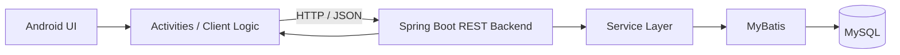
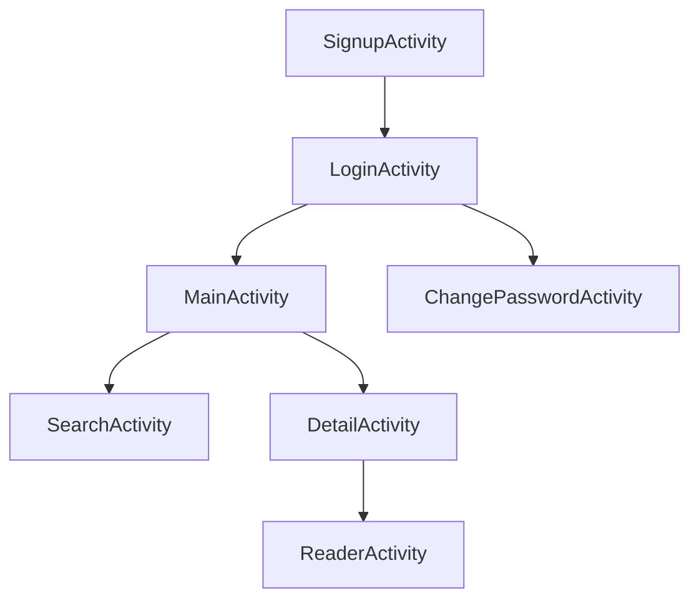

<div align="center">

# BookReader
### Java Spring Boot Backend + Android/Kotlin Novel-Reading Application


</div>

## Overview

**BookReader** is a collaborative winter project developed for **West2 Online**. It implements a complete client–server novel-reading workflow with an Android application on the client side and a Java Spring Boot service on the backend.

The repository is useful as an early full-stack engineering project because both sides of the system are preserved together: Android UI and interaction logic, backend APIs, database access, and the original release APK.

## Team

- **Bo Liu** — Java / Spring Boot backend
- **Sun Xun** — Android client

## Architecture



## Main User Flow

The Android source contains dedicated activities for the major application workflows:



Based on the preserved client code, the app includes:

- account registration and login;
- password modification;
- book search;
- book-detail display;
- reading interface;
- shared application/activity management;
- data-access/client-side support code.

## Technology Stack

### Android Client

- Kotlin / Android SDK
- Gradle-based Android build
- Activity-oriented UI flow
- Local assets and application resources
- Packaged release APK included in the repository

### Backend

The backend `pom.xml` uses:

- Java 8
- Spring Boot 2.6.3
- Spring Web
- MySQL Connector/J 8.0.28
- MyBatis 3.4.6
- Lombok
- Jackson / JSON libraries
- JUnit
- Maven

## Repository Structure

```text
west2_test4_BookReader/
├── BookReader(android)/
│   ├── app/
│   │   ├── src/main/
│   │   │   ├── AndroidManifest.xml
│   │   │   ├── java/com/example/bookreader/
│   │   │   ├── assets/
│   │   │   └── res/
│   │   └── release/app-release.apk
│   └── build.gradle / Gradle files
├── BookReader(java)/
│   ├── pom.xml
│   └── src/
└── README.md
```

## Android Entry Points

| File | Responsibility |
| --- | --- |
| `LoginActivity.kt` | User login |
| `SignupActivity.kt` | Account registration |
| `MainActivity.kt` | Main application screen |
| `SearchActivity.kt` | Book search |
| `DetailActivity.kt` | Book-detail page |
| `ReaderActivity.kt` | Reading interface |
| `ChangePasswordActivity.kt` | Password update |
| `ActivityCollector.kt` | Shared activity lifecycle management |
| `BaseActivity.kt` | Common activity behavior |

## Running the Backend

```bash
cd 'BookReader(java)'
mvn clean package
mvn spring-boot:run
```

Before starting the backend, inspect the application configuration and update:

- MySQL host, port, database, username, and password;
- local server port if needed;
- any environment-specific file paths.

## Running the Android Client

1. Open `BookReader(android)` in Android Studio.
2. Let Gradle synchronize the project.
3. Update the backend base URL to the address of the running Spring Boot server.
4. Build and run on an emulator or Android device.

The repository also preserves the original packaged build:

```text
BookReader(android)/app/release/app-release.apk
```

## Engineering Notes

This repository comes from an earlier development environment, so a modern build may require dependency, Gradle, Android SDK, or database-configuration updates. Keeping the original project structure makes it possible to inspect how the client and server were coordinated during the original team project.

## Portfolio Context

BookReader represents an early stage of my software-engineering experience, particularly **client–server integration, REST-style backend development, relational persistence, and collaboration across frontend/backend responsibilities**.

## Contact

For backend-related questions, contact **Bo Liu** at `liubo317@hnu.edu.cn`.  
Homepage: https://boliupro.github.io
